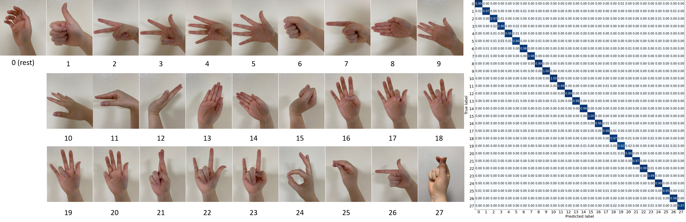

# Research

My work connects learning-based control, model-based control, and physical robot systems. My current focus is humanoid robotics; my earlier work explored wearable robot control and soft sensing for human–robot interaction.

## Current Focus: Humanoid Robotics

### Learning-based locomotion and sim-to-real transfer

I work on reinforcement learning for humanoid locomotion, with an emphasis on reliable deployment on physical robots. This includes modeling actuator behavior, designing simulation environments, and accounting for the differences between simulated and real control systems.

### Coordinated locomotion and manipulation

I am exploring how learning-based control of the lower body can work with model-based control of the arms. The goal is to coordinate balance, positioning, and precise manipulation on humanoids with different actuator characteristics across the body.

### Actuator dynamics and real-time control

My work also involves actuator characterization and integration of learned policies with low-level robot control. Understanding the relationship between the drivetrain, feedback controller, and policy is essential for reliable hardware behavior.

## Earlier Research: Wearable Robot Control

Research at KAIST's EXO Lab, supported by the National Research Foundation of Korea (NRF) project on human motor control theory for wearable robots to overcome gait disorders.

### MPC-based stride-to-stride reference generation



This project investigated model predictive control for generating a one-stride reference trajectory for bipedal robots under modeling errors and external disturbances. The reference accounts for zero moment point (ZMP) stability and transitions between gait phases, providing a trajectory for a low-level controller to track.

### Transferring human motion to robots with limited degrees of freedom



This work explored transferring human walking styles to wearable robots with limited degrees of freedom using [Adversarial Motion Priors](https://arxiv.org/abs/2104.02180). The aim was to generate natural motion while accounting for joint limits, wearer safety, and energy use.

### Robust control for wearable robots



Wearable robots must respond to nonlinear and time-varying disturbances from their users. This project explored combining learning-based and model-based control to handle those disturbances while adapting reference trajectories to the robot's range of motion and the wearer's needs.

## Earlier Research: Soft Sensing and Human–Robot Interaction

Research supported by the NRF biosignal sensor fusion technology development program, with a focus on sensing human motion and muscle activity for robot interaction.

### Wrist gesture recognition using pneumatic mechanomyography

We investigated high-resolution features from the passive elastic elements around the wrist for hand gesture recognition. In a study with 10 participants and five-fold cross-validation, the system classified 28 gestures with 98.0% accuracy. The eight-channel sEMG baseline (Delsys, USA) achieved 93.1% accuracy under the reported evaluation.

Published in [*IEEE Transactions on Industrial Informatics*](https://ieeexplore.ieee.org/abstract/document/10136753).

### Gesture recognition during arm movement



This project investigated how dynamic arm movements affect gesture recognition outside controlled conditions. The work examined sensor placement, training strategies, and classification methods, as well as rejection of out-of-distribution inputs to improve robustness in practical use.

### Real-time gait analysis with soft sensors




This work explored ergonomic soft sensors for identifying gait phases and walking modes. The aim was to reduce dependence on rigid sensor mounts and their associated alignment issues while enabling real-time analysis.

Related early results were presented at [ICCAS 2021](https://ieeexplore.ieee.org/document/9649762) and [IFAC Mechatronics 2022](https://www.sciencedirect.com/science/article/pii/S240589632202612X).

## Selected Coursework

### Momentum Frame: Learning Physics from Momentum Information



**CS570 — Artificial Intelligence and Machine Learning**

This course project explored a learned alternative to a material point method (MPM) simulation. The model generates a sequence from a single input frame using noise-to-noise learning, a mean squared error objective, and an adversarial objective. In the course evaluation, it ran more than 50 times faster than the baseline MPM implementation.

A [CoordConv layer](https://arxiv.org/abs/1807.03247) helped the network represent spatial information relevant to potential energy. The adversarial objective was used to reduce distribution drift during repeated prediction.
