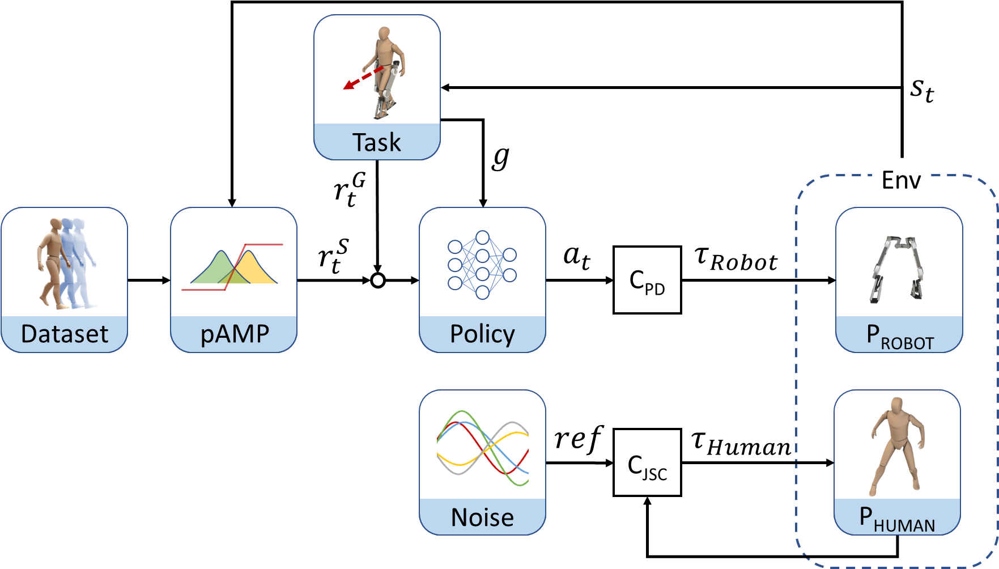
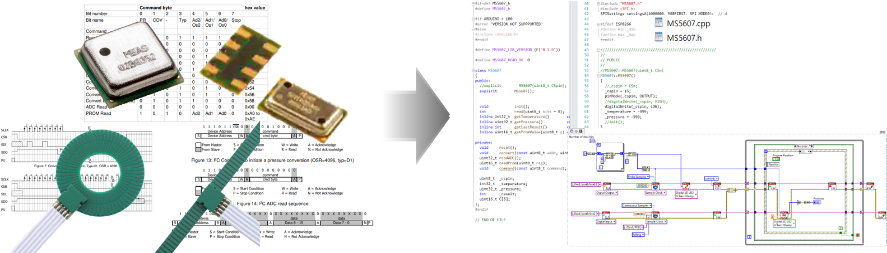
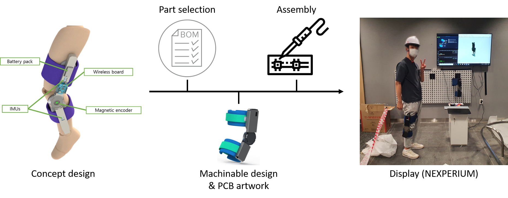
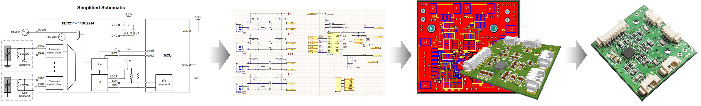

# Technical Skills

I work across control, learning, simulation, and hardware integration, with an emphasis on deploying algorithms on physical robots.

## Robot Control and Learning

- Reinforcement learning for humanoid locomotion and motion imitation
- Model-based and predictive control for robot motion
- Actuator modeling, system identification, and sim-to-real transfer
- Machine learning for noisy sensor signals and real-world classification tasks

## Simulation and Development Tools

- Robot simulation and training environments using Isaac Lab, Isaac Sim, Isaac Gym, and MuJoCo
- Physics-based modeling and domain randomization for robot control
- Python and C/C++ development
- ROS 2 integration and robot control software



## Embedded Systems and Communication

- Embedded development on STM32, NVIDIA Jetson, and National Instruments platforms
- Real-time control integration, including EtherCAT-based actuator communication
- RTOS and LabVIEW experience
- Wired and wireless interfaces: SPI, I²C, SSI, UDP, TCP/IP, and BLE

## Mechanical Design and System Integration

- Mechanical design for machining and additive manufacturing
- Component selection, assembly, and hardware debugging
- Integration of mechanical, electronic, sensing, and control subsystems

## Electronics and PCB Design

- Datasheet review, circuit schematics, and PCB layout
- PCB design using Altium
- Sensor and embedded electronics integration

